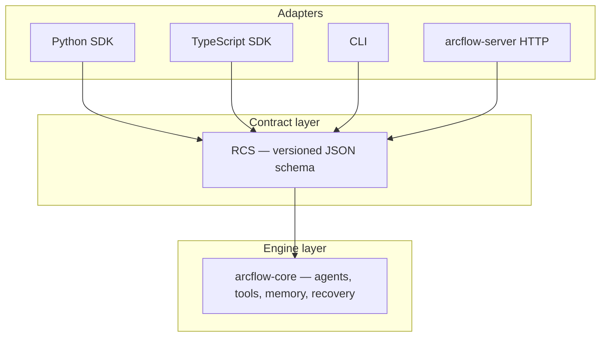

<p align="center">
  
</p>

<p align="center">
  <b>Production workflow runtime for AI agent pipelines</b>
</p>

<p align="center">
  <a href="https://github.com/isonlycoolie/ArcFlow/actions/workflows/ci.yml"></a>
  <a href="contracts/README.md"></a>
  <a href="Cargo.toml"></a>
</p>

<p align="center">
  <strong>
    <a href="#what-is-arcflow">Overview</a> •
    <a href="#why-arcflow">Why ArcFlow</a> •
    <a href="#capabilities">Capabilities</a> •
    <a href="#deployment-modes">Deployment</a> •
    <a href="#sdks--tools">SDKs</a> •
    <a href="#examples">Examples</a> •
    <a href="documentation/README.md">Documentation</a> •
    <a href="#contracts--api">Contracts</a> •
    <a href="#quick-start">Quick Start</a>
  </strong>
</p>

## What is ArcFlow

**ArcFlow** is a self-hosted AI workflow runtime built in Rust. It executes multi-step agent pipelines: LLM calls, structured tool loops, vector memory, branching logic, and human approval gates, with the same semantics whether you embed it in Python, call it from TypeScript, or run it behind an HTTP server.

You define workflows as ordered steps or directed graphs. The runtime owns orchestration: step scheduling, retries, timeouts, state propagation, recovery checkpoints, and trace correlation. Language SDKs are thin bindings over a single engine, not parallel reimplementations of the same logic.

> **One engine, every surface.** Orchestration lives in `arcflow-core` (Rust). SDKs serialize workflow definitions into the Runtime Contract Specification (RCS), invoke the engine, and deserialize results. A fix in retry policy or recovery ships once and applies everywhere.

ArcFlow targets teams that need **production-grade agent infrastructure on their own stack**: predictable behavior under load, explicit failure modes, privacy-safe observability, and wire formats you can version and audit.

## Why ArcFlow

Most agent frameworks optimize for getting a demo running quickly. ArcFlow optimizes for **running the same workflow in production for months**: identical execution across languages, typed errors instead of silent degradation, and contracts that outlive any one SDK release.

<table>
<tr>
<td width="50%" valign="top">

### One engine, every surface

Orchestration lives entirely in `arcflow-core` (Rust). Python and TypeScript serialize workflow definitions into RCS, invoke the engine, and deserialize results. See [Architecture overview](documentation/concepts/architecture-overview.md).

</td>
<td width="50%" valign="top">

### Contract-first integration

RCS is a versioned JSON schema for workflows, agents, messages, and trace events. Normative specs under [contracts/](contracts/README.md) define provider boundaries, recovery DDL, and observability rules.

</td>
</tr>
<tr>
<td width="50%" valign="top">

### Self-hosted by design

You run the binary, Postgres, and vector store. API keys stay in your environment. Traces record metadata (step timing, token counts, status codes), not prompt or completion text. No mandatory cloud control plane.

</td>
<td width="50%" valign="top">

### Built for failure

Recovery persists run state to Postgres and resumes from the failed step after restart. Per-step retries use configurable backoff. Human-in-the-loop gates block until an operator acts. Missing infrastructure returns a typed error instead of falling back silently.

</td>
</tr>
</table>

## Capabilities

<table>
<tr><th>Area</th><th>What you get</th></tr>
<tr>
<td><strong>Workflow execution</strong></td>
<td>
<strong>Linear pipelines</strong> with deterministic scheduling and context handoff<br>
<strong>Graph workflows (DAG)</strong> with branch, join, and conditional routing<br>
<strong>Execution modes</strong> for embedded in-process vs remote server runs<br>
<strong>Workflow registry</strong> with semver <code>workflow_ref</code> resolution
</td>
</tr>
<tr>
<td><strong>Agents, tools, providers</strong></td>
<td>
<strong>Multi-agent steps</strong> with role, instructions, and optional tools<br>
<strong>Structured tool loops</strong> with schema-validated OpenAI-compatible function calling<br>
<strong>Provider boundary</strong> — swap OpenAI, Anthropic, Gemini at run time<br>
<strong>Stub and live paths</strong> for CI and production
</td>
</tr>
<tr>
<td><strong>Memory and knowledge</strong></td>
<td>
<strong>Session, shared, and persistent memory</strong> scoped by the runtime<br>
<strong>Vector memory (RAG)</strong> with Qdrant-backed retrieval<br>
<strong>Dashboard-driven knowledge</strong> — documents and embedding keys stay server-side
</td>
</tr>
<tr>
<td><strong>Reliability and control</strong></td>
<td>
<strong>Postgres-backed recovery</strong> — <code>resume(run_id)</code> from failed step<br>
<strong>Retry and timeout policies</strong> per step and workflow<br>
<strong>Human-in-the-loop</strong> with durable approval state<br>
<strong>Intelligent retry triggers</strong> on classified transient failures
</td>
</tr>
<tr>
<td><strong>Observability</strong></td>
<td>
<strong>Metadata-only execution traces</strong> — step timing, tokens, tool/memory events<br>
<strong>OpenTelemetry export</strong> for Grafana, Jaeger, Prometheus (<a href="docker/observability-otel.md">guide</a>)<br>
<strong>CLI and VS Code extension</strong> for validate, trace, step-through debug
</td>
</tr>
<tr>
<td><strong>Static and edge</strong></td>
<td>
<strong>ArcFlow Relay</strong> — origin-validated proxy; secrets off the CDN bundle<br>
<strong><code>runPublished()</code></strong> — semver-pinned workflows from the browser<br>
<strong>Edge WASM (alpha)</strong> — stub linear workflows on Cloudflare Workers
</td>
</tr>
</table>

## Architecture

ArcFlow stacks three layers. SDKs and the HTTP server are adapters; the engine and contract sit below.



Fault tolerance, validation, and scheduling are implemented once in the engine layer. SDKs pass `ExecutionConfig` (retry, timeout, recovery flags) as JSON; they do not reimplement orchestration.

## Deployment modes

<table>
<tr><th>Mode</th><th>When to use</th><th>Docs</th></tr>
<tr>
<td><strong>Self-hosted server</strong></td>
<td>Graph workflows, Postgres recovery, vector memory, workflow registry, HTTP API for backend services</td>
<td><a href="server/arcflow-server/README.md">arcflow-server</a></td>
</tr>
<tr>
<td><strong>ArcFlow Relay</strong></td>
<td>Static sites (Vite, Next.js export, CDN) — browser uses site token only; no LLM keys in the bundle</td>
<td><a href="examples/static/README.md">Static examples</a></td>
</tr>
<tr>
<td><strong>Edge WASM (alpha)</strong></td>
<td>Low-latency stub linear workflows at the CDN edge while full edge parity matures</td>
<td><a href="docker/edge-deployment-cloudflare.md">Cloudflare guide</a></td>
</tr>
</table>

## SDKs & Tools

| Surface | Path | Purpose |
|---------|------|---------|
| Python SDK | [sdk-python](sdk-python/README.md) | Workflow definitions backed by the Rust runtime |
| TypeScript SDK | [sdk-typescript](sdk-typescript/README.md) | Promise-native SDK with N-API bindings |
| Browser client | [packages/arcflow-static](packages/arcflow-static) | Relay mode (`runPublished`) |
| VS Code extension | [extensions/vscode-arcflow](extensions/vscode-arcflow/README.md) | Graph view, trace timeline, local debug |
| CLI | [cli/arcflow-cli](cli/arcflow-cli) | `validate`, `run`, `trace`, TUI |

## Examples

| Example | Description |
|---------|-------------|
| [examples/static/chat-rag](examples/static/chat-rag/) | Landing-page support chat with RAG via relay |
| [examples/static/online-application-chatbot](examples/static/online-application-chatbot/) | Multi-turn intake with external callback |
| [examples/relay/byo-docker](examples/relay/byo-docker/) | Self-hosted relay with the same browser contract as managed relay |

## Contracts & API

Production wire formats live under [contracts/](contracts/README.md). Integrator-facing HTTP routes are documented in [HTTP API reference](documentation/server/http-api-reference.md).

| Document | Purpose |
|----------|---------|
| [RCS v1 schema](contracts/normative/rcs/v1.schema.json) | Workflow and message data model |
| [HTTP API reference](documentation/server/http-api-reference.md) | Self-hosted server routes (`/v1/runs`, admin, health) |
| [Trace events v1](contracts/normative/observability/trace-events-v1.md) | Observability event schema and trace data policy |
| [Provider API v1](contracts/normative/providers/api-v1.md) | LLM provider boundary |

Validate the RCS schema: `bash scripts/validate-rcs-schema.sh`

## Quick Start

For a first run, start dev dependencies (`docker compose -f docker/docker-compose.dev.yml up -d`), then follow [server/arcflow-server/README.md](server/arcflow-server/README.md) or the [Python SDK guide](sdk-python/README.md). Static-site production paths start at [examples/static/README.md](examples/static/README.md).

## Contributing

Contributions are welcome.

<details>
<summary>Pre-push checks</summary>

```bash
cargo fmt --check
cargo clippy --workspace --all-targets -- -D warnings
cargo test --workspace
```

Keep commits focused. Local check for commit size: `bash scripts/check-commit-size.sh --commit HEAD`.

</details>

## License

ArcFlow is licensed under **MIT OR Apache-2.0** at your option. See [Cargo.toml](Cargo.toml) for workspace metadata.
